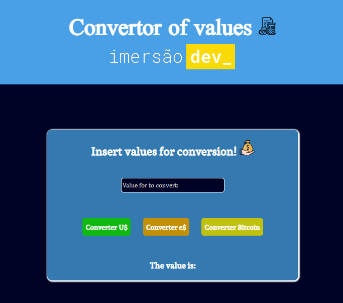

# Conversor de Moedas 💸

**Este é um conversor de moedas com base nos valores de Euro, Dólar, e/ou Bitcoin tratados como a conversão a partir do valor submetido pelo usuário. Este site foi desenvolvido e guiado pela alura na imersãoDev!**

#AluraDev
# 

## Mais cobre o código...

Pode se perceber que em todo o código, não se trata de funções que se destinam ou tem nomes, mas sim que se baseiam em sua própria variável em uma *arrow function*, sendo assim, ela se torna mais automática, funcional, porém individual, foi a melhor forma que eu gostei de tratar este código...
